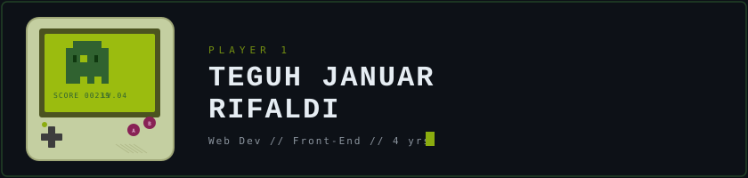

<div align="center">

<!-- Game Boy Header Banner -->


<br/><br/>


<br/>


</div>

---

## 🎮 STATUS SCREEN

```text
┌──────────────────────────────────────────────┐
│  HP ████████████░░░░░░░░  72%                │
│  XP ██████░░░░░░░░░░░░░░  LVL 04 — WEB DEV   │
│  COIN x4  │  HIGH SCORE: KEEP GRINDING       │
└──────────────────────────────────────────────┘
```

| Quest | Detail |
|:------|:-------|
| 🔭 **Now Playing** | `--` |
| 🌱 **Skill Tree** | JavaScript & Python |
| 💬 **Party Chat** | 4 years Front-End experience with team collab |
| 📫 **Save Point** | enemyteguh@gmail.com |
| ⚡ **Easter Egg** | I think I am a Weebs |

---

## 🕹️ CONTRIBUTION GRAPH

<picture>
  <source media="(prefers-color-scheme: dark)" srcset="https://raw.githubusercontent.com/DaraH06/DaraH06/output/breakout-contribution-graph-dark.svg">
  <source media="(prefers-color-scheme: light)" srcset="https://raw.githubusercontent.com/DaraH06/DaraH06/output/breakout-contribution-graph.svg">
  
</picture>

<p align="center">
  <a href="https://gh-tetris.vercel.app/?username=DaraH06">
    
  </a>
</p>

---

## 📊 SCORE BOARD

<div align="center">


&nbsp;


<br/><br/>


</div>


<br/>

<div align="center">


</div>

---

## 🏆 ACHIEVEMENTS UNLOCKED

<h3 align="left">🛠️ Inventory — Languages & Tools</h3>

<p align="left">
  
</p>

---

## 🔗 MULTIPLAYER

<h3 align="left">Connect with me:</h3>

<p align="left">
  <a href="https://github.com/DaraH06" target="_blank">
    
  </a>
  &nbsp;
  <a href="mailto:enemyteguh@gmail.com">
    
  </a>
</p>

---

<div align="center">

```text
 ╔══════════════════════════════════════╗
 ║   THANK YOU FOR PLAYING!             ║
 ║   GAME OVER? PRESS START TO CONNECT  ║
 ╚══════════════════════════════════════╝
```


</div>
